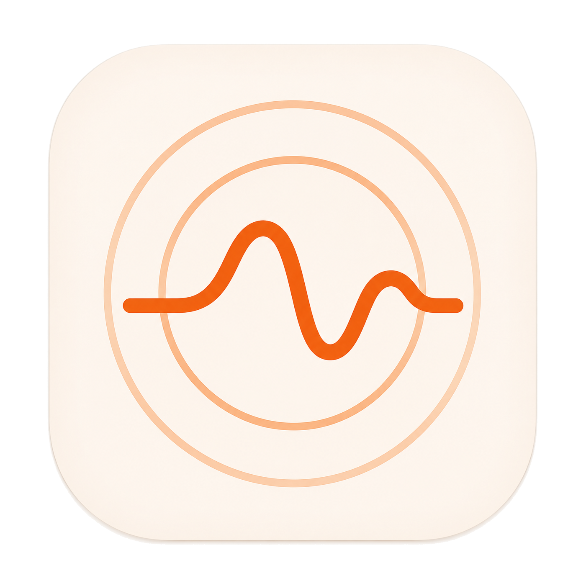

<div align="center">



# Resound

**Turn every conversation into searchable personal memory.**

A native macOS (Swift / SwiftUI · Apple Silicon) personal wiki:
record → transcribe → diarize → chunk & index → search & ask, end to end.


-f05138)

**English** · [简体中文](README.zh-CN.md)

</div>

---

Resound records your meetings and one-on-ones, turns them into speaker-labeled,
timestamped, sentence-level transcripts, generates structured meeting notes, and
chunks and indexes everything — so you can query your own knowledge base in
**natural language and get answers with citations and dates**.

It gets to know you the more you use it: name a speaker once and the same voice is
recognized automatically next time; add your team's jargon to the glossary and the
transcripts stop getting it wrong.

> [!NOTE]
> Resound itself is a **pure implementation that contains no personal data**. Your
> audio, transcripts, and annotations all live in a git repository (vault) that you
> designate yourself and that conforms to the [data contract](docs/data-contract.md).

## Features

- **Meeting recording** — One click captures your mic + the other side of a Google Meet call (dual-track mix via ScreenCaptureKit). When a Meet call is detected it pops a screen-level prompt; you can set it to **auto-start on meeting begin / auto-stop on meeting end** (or surface a one-click confirmation panel), no manual steps needed.
- **Transcription** — Defaults to online `whisper-large-v3-turbo` (fast), with local WhisperKit as an offline fallback. Before upload, silero VAD **trims long silences/noise** (cutting whisper's "thanks for watching"-style hallucinations and saving tokens, with timestamps mapped back to the original timeline), then loudness-normalizes speech. After transcription: Traditional→Simplified normalization + glossary correction + **LLM proofreading** (fixing homophone typos and misheard English proper nouns).
- **Speaker diarization** — Sortformer neural segmentation (running on the Apple Neural Engine) → silero VAD to drop silence → CAM++ voiceprints → match against the enrollment library for real names; clusters are merged when voiceprints are close, with naming kept mutually exclusive to prevent mismatches. Name a voice once and its voiceprint is remembered, recognized automatically across recordings — the more you label, the more accurate it gets.
- **AI meeting notes** — Templated summaries (general / one-on-one / team meeting / brainstorm), written into the searchable index. When a recording has **linked documents**, their full text is automatically fed in as background (with a length cap), so summaries reflect the PRD/agenda/minutes too. The **Templates page** lets you add, edit, and delete templates (placeholders include `{documents}`), get AI help generating/polishing prompts, and set a default.
- **Search & Q&A** — FTS5 keyword + vector recall + RRF fusion + LLM rerank + synthesis; answers come **with citations and dates**. A planner reads each question and routes it to the right shape: pinpoint facts, **digest** ("what did we cover this month"), **timeline** ("how did the migration strategy evolve"), or **compare** ("this week's vs last week's 1-on-1"). Filters compose freely — by time, **by speaker** ("what have Jerry and I discussed"), or by source — and **recency-aware** queries ("the latest plan") favor the most recent discussions. Broad reviews retrieve across your whole history (map-reduce when large), not just a handful of snippets; when a filter matches nothing it **relaxes automatically** instead of dead-ending. Citations are **source-aware** — a single answer can mix 🎙️ recordings and 📄 documents, each clickable (recordings jump to the timestamp, documents open with the cited passage highlighted). You can also **ask about a single recording** or **a single document**, with retrieval scoped strictly to that item.
- **Documents** — Import external material alongside your recordings: meeting PRDs, minutes, compliance docs. Rich formats are parsed into searchable text using native macOS frameworks (zero dependencies): **PDF** (text layer + heading inference, with **OCR fallback for scanned PDFs**), **Word (.docx)**, **PowerPoint (.pptx)**, **HTML**, **images** (Vision OCR, Chinese + English), plus Markdown / plain text. For PDFs and images, the messy extracted text is then **auto-reformatted into clean, readable Markdown by an LLM** (semantics strictly preserved — merge broken lines, drop repeated headers/footers, rebuild tables). The real original file is archived alongside the extracted text. Each document is indexed into the same knowledge base, so it **joins recordings in global Q&A**. Documents and recordings can be **linked both ways** (manage from either side), and each document has its own metadata, tags, and "Ask this document" tab.
- **Recording library** — Search, folder grouping, ⌘F find & replace (to fix transcription typos), click-to-jump sentence playback, and speaker preview; repeatedly fixing the same wrong word **auto-suggests adding it to the glossary** with one-click confirm.
- **Bring-your-own provider** — Connect to any OpenAI-compatible service (OpenAI / Claude / DeepSeek / Groq / AIHUBMIX / local Ollama / custom): chat, embedding, and transcription are each configured separately, with a one-click "Test connection" that validates live (validation state is persisted and auto-invalidated when you change the key/model). First launch has an onboarding flow; leave transcription unconfigured and it falls back to local Whisper. The vault path and git auto-push are also configured in-app, taking effect immediately with no rebuild.
- **Menu-bar resident** — Closing the main window doesn't quit; it stays in the menu bar ready to record anytime. Light / dark themes.

## Architecture boundaries

Resound keeps three things **physically separate** and never mixes them:

| | Contents | Location | Nature |
|---|---|---|---|
| **App** (this repo) | Swift / SwiftUI implementation | `Wynne-cwb/resound` | Program, no data |
| **Vault** | Audio / transcripts / annotations / people / notes | A git repo you configure | **Source of truth**, portable |
| **Index** | SQLite + FTS5 + sqlite-vec + voiceprint vectors | Local App Support | **Derived**, rebuildable |

> [!IMPORTANT]
> Core invariant: **delete the entire Index and the App can fully rebuild it from the Vault.**
> This decides what goes into the Vault vs. the Index — see the [data contract](docs/data-contract.md).

### Create your own vault

A vault is just a folder (a git repo you own) with a small, fixed structure. Scaffold a minimal one:

```bash
mkdir my-resound-vault && cd my-resound-vault && git init

# Audio goes through Git LFS (keeps the repo text-diffable and portable)
cat > .gitattributes <<'EOF'
*.m4a  filter=lfs diff=lfs merge=lfs -text
*.flac filter=lfs diff=lfs merge=lfs -text
*.wav  filter=lfs diff=lfs merge=lfs -text
EOF

# Vault config (schema versioned — keep the schema line)
cat > resound.yaml <<'EOF'
schema: resound.vault/1
vault_name: my-wiki
timezone: Asia/Singapore
default_language: en
EOF

# People registry — starts with just you; speakers get named here over time
mkdir people && cat > people/people.yaml <<'EOF'
schema: resound.people/1
people:
  - id: p_self
    name: Me
    aliases: [myself]
EOF

mkdir recordings
git add -A && git commit -m "init vault"
```

Then point Resound at this folder — in **Settings › Storage › Recording library**, or set `VAULT_PATH` in `.env` for the CLI. The app validates `resound.yaml` + `recordings/` + `people/`, reads and writes this local copy, and (if you enable git sync) commits and pushes back to your repo.

> [!IMPORTANT]
> Your vault holds your personal data (audio, transcripts, who-said-what). **Push it to a _private_ repo you own** — never a public one. The full schema for every file is in the [data contract](docs/data-contract.md).

## Getting started

### Prerequisites

- macOS 14+ / Apple Silicon
- Swift 6 toolchain (Xcode 16+ or `swiftly`)
- Voiceprints depend on the sherpa-onnx static library (built locally on first use, ~hundreds of MB, gitignored)

```bash
# 1. Build the sherpa-onnx voiceprint static library (one-time)
scripts/build-sherpa-onnx.sh

# 2. Configure keys: create .env in the repo root (see the "Configuration" table below)

# 3. Build (first run pulls WhisperKit / FluidAudio / MarkdownUI etc.)
swift build
```

### Run the CLI

```bash
.build/debug/resound doctor                      # self-check key dependencies
.build/debug/resound record                      # record → transcribe → write to vault
.build/debug/resound index                       # rebuild the search index from the vault
.build/debug/resound ask "what did last week's one-on-one cover"   # Q&A with citations
```

### Bundle and run the App

```bash
scripts/bundle-app.sh release    # output: build/Resound.app (with entitlements + ad-hoc signing)
open build/Resound.app
```

> [!TIP]
> After rebuilding, if an old instance is still running `open` just brings it to the front.
> Run `killall Resound` first, then `open`.

## Configuration

**Regular users (in-app):** Follow the onboarding on first launch — in **Settings › AI Services**, pick a provider preset (or go custom), fill in Base URL / API Key / model, and you're good once "Test connection" passes. You need at least one **chat model** + one **embedding model** (they can be from different providers); transcription can be left blank to use local Whisper. Config is stored on-device at `~/Library/Application Support/Resound/providers.json`, keys never leave your machine, can be imported/exported, and changes take effect immediately.

**CLI / advanced:** You can also use a `.env` in the repo root (gitignored, **never committed**); all endpoints are OpenAI-compatible. The App reads `providers.json` first and falls back to `.env` when missing (existing `.env` users are auto-migrated on first launch). The `.env` variables:

| Variable | Purpose |
|---|---|
| `AIHUBMIX_API_KEY` / `AIHUBMIX_BASE_URL` | Embeddings (vectors); also used for online transcription by default |
| `EMBEDDING_MODEL` / `EMBEDDING_DIM` | Embedding model and dimension |
| `CHAT_API_KEY` / `CHAT_BASE_URL` | LLM (DeepSeek official, OpenAI-compatible) |
| `TRANSCRIBE_ONLINE` / `TRANSCRIBE_MODEL` | Online transcription toggle and model (off → local WhisperKit) |
| `TRANSCRIBE_API_KEY` / `TRANSCRIBE_BASE_URL` | Transcription endpoint; defaults to the Embedding one |
| `CONTEXT_MODEL` | Per-chunk contextual enrichment (high frequency, defaults to flash) |
| `CORRECT_MODEL` | Transcription AI proofreading (defaults to flash) |
| `RERANK_MODEL` | Recall reranking |
| `ANSWER_MODEL` / `SUMMARY_MODEL` | Final synthesis / summary (defaults to pro) |

At runtime the App copies the root `.env` to `~/Library/Application Support/Resound/.env` and adds `VAULT_PATH` and `SPEAKER_MODEL`.

## CLI commands

| Command | Description |
|---|---|
| `record` / `record-meeting` | Mic recording / dual-track meeting recording → transcribe → write to vault |
| `transcribe` | Transcribe existing audio and write to vault |
| `transcribe-correct` | Run AI proofreading over an existing transcript (fix homophone typos / terms) |
| `watch-meet` | Watch whether Chrome has a Google Meet open |
| `diarize` / `speaker-recognize` | Speaker segmentation / identify speakers via the voiceprint library |
| `speaker-identify` | Identify with enrolled voiceprints and write back (batch-fix old recordings after enrolling someone new) |
| `speaker-enroll` / `speaker-label` | Enroll a voiceprint / label an existing index in place |
| `diarize-eval` / `diarize-compare` | Evaluate against ground truth / compare diarization approaches |
| `normalize` | Redo Traditional→Simplified normalization + alias correction over an existing transcript |
| `redate` | Fix a recording's meeting date from the date in its title |
| `import-doc` | Import a local document into the vault + index it (md/txt/pdf/docx/pptx/html/image; documents join recordings in Q&A) |
| `extract-doc` | Parse a document to markdown and print it (debug; no index/config needed) |
| `retidy-doc` | Re-extract + LLM-reformat an already-imported document in place, then rebuild its index |
| `index` | Rebuild the search index from the vault (chunk → embedding → SQLite/FTS5/vec) |
| `search` | Hybrid retrieval (FTS5 + vector + RRF) |
| `summarize` | Generate an AI summary for a recording (writes summary.md + indexes it) |
| `ask` | Q&A: retrieve + rerank + LLM synthesis, output an answer with citations |
| `doctor` | Self-check key dependencies such as sqlite-vec |

## How it works

```
record ─► VAD gating (trim silence/noise) ─► transcribe (online whisper / local WhisperKit) ─► zh normalization + glossary correction + LLM proofread
   └─► diarization (Sortformer segmentation @ANE → VAD → CAM++ voiceprints → enrollment match)
                          │
chunk ─► contextual enrichment ─► embedding ─► SQLite (FTS5 + sqlite-vec)
                                              │
ask ─► QueryPlanner (LLM extracts time range / decides qa·digest)
   └─► FTS5 + vector recall ─► RRF fusion ─► LLM rerank ─► synthesis (with citations · with dates)
```

## Tech stack

- **Local:** AVAudioEngine · ScreenCaptureKit · WhisperKit · FluidAudio (Sortformer segmentation / silero VAD) · sherpa-onnx (CAM++ voiceprints) · SQLite (FTS5 + sqlite-vec)
- **Dependencies:** [WhisperKit](https://github.com/argmaxinc/WhisperKit) · [FluidAudio](https://github.com/FluidInference/FluidAudio) · [swift-markdown-ui](https://github.com/gonzalezreal/swift-markdown-ui) · [swift-argument-parser](https://github.com/apple/swift-argument-parser)
- **API:** Any OpenAI-compatible service — chat / embedding / transcription can each be assigned to a different provider

## Project structure

```
Sources/
  ResoundApp/    SwiftUI App (windows / library / settings / panels)
  ResoundCore/   Core logic (transcription / voiceprints / chunking / indexing / retrieval / summaries)
  resound/       CLI entry point
  CSQLiteVec/    sqlite-vec C bridge
  CSherpaOnnx/   sherpa-onnx voiceprint C API bridge
scripts/         build-sherpa-onnx.sh · bundle-app.sh
docs/            data-contract.md · DECISIONS.md · STATE.md
```

## Documentation

- [Data contract](docs/data-contract.md) — the project's foundation, followed by every module
- [Decision log](docs/DECISIONS.md) — choices, pitfalls, and completed practices
- [Current state](docs/STATE.md) — in-progress / next-step snapshot
